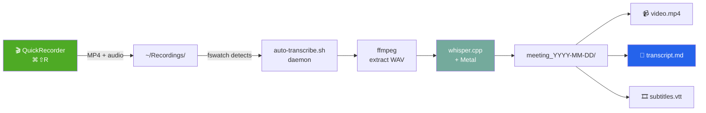

<div align="center">

# 🎙️ KT Recorder with STT

**Приватный локальный рекордер встреч с автоматической транскрибацией для macOS**

Нажми кнопку — запиши — получи `.md` с текстом. Без облаков, без подписок, без телеметрии.

[](https://www.apple.com/macos/)
[](https://www.apple.com/mac/)
[](LICENSE)
[](https://github.com/ggml-org/whisper.cpp)
[](https://www.gnu.org/software/bash/)
[](docs/custom-models.md)
[](CONTRIBUTING.md)

[**Установка**](#-установка) • [**Как работает**](#-как-это-работает) • [**Конфигурация**](#️-конфигурация) • [**FAQ**](#-faq) • [**Contributing**](CONTRIBUTING.md)

</div>

---

## 📸 Демо

<div align="center">

> _Добавь сюда GIF/скриншот когда запишешь первую встречу_
>
> `assets/demo.gif` — основной флоу: хоткей → запись → транскрипт

</div>

```
🎬 ⌘⇧R → [recording...] → ⌘⇧R → ⏳ transcribing → ✅ folder opened
```

---

## ✨ Возможности

- **Одна кнопка** — глобальный хоткей `⌘⇧R` для старта и остановки
- **Нативные уведомления** на каждом этапе (старт, обработка, готово)
- **Полная приватность** — всё обрабатывается локально, ни байта наружу
- **Метал-ускорение** на Apple Silicon через whisper.cpp
- **Разделённые аудиодорожки** — твой голос и собеседник отдельно
- **Русский язык из коробки** с моделью Large-v3 (или опционально fine-tune)
- **Казахский и kk+ru code-switching** через опциональный бэкенд Qwen3-ASR — русские встречи остаются на whisper, смешанные автоматом уходят на модель которая умеет переключаться между языками внутри фразы ([подробнее](docs/custom-models.md#-казахский--kkru-code-switching))
- **Автороутер языков** — `scripts/transcribe-auto.sh` сам детектит язык и выбирает бэкенд
- **Саммаризация встреч** — `scripts/summarize.sh` превращает транскрипт в протокол с участниками, проектами, цитатами, таблицами и action items. Работает локально через Ollama (рекомендуется `qwen3:32b` для M4 Pro 24GB) или через Anthropic API для топового качества
- **Markdown + VTT-субтитры** — открывается где угодно, играется в IINA/VLC с субтитрами
- **Автозапуск** через LaunchAgent, работает молча в фоне
- **Совместимо с Obsidian** — frontmatter и теги в каждом файле

---

## 🚀 Установка

### Требования

| Что | Минимум | Рекомендуется |
|---|---|---|
| macOS | 13 Ventura | 14+ Sonoma |
| Чип | Intel / Apple Silicon | M1/M2/M3/M4 |
| RAM | 8 ГБ | 16+ ГБ для Large-v3 |
| Диск | 5 ГБ | 10+ ГБ |
| [Homebrew](https://brew.sh) | ✅ обязательно | |

### В одну команду

```bash
git clone https://github.com/YOUR_USERNAME/kt-recorder-with-stt.git
cd kt-recorder-with-stt
./install.sh
```

Установщик сам:
- ✅ поставит зависимости (`whisper-cpp`, `ffmpeg`, `fswatch`, `terminal-notifier`, `quickrecorder`)
- ✅ скачает модель Whisper Large-v3 (~3 ГБ)
- ✅ разложит скрипты в `~/bin/kt-recorder/`
- ✅ создаст конфиг в `~/.config/kt-recorder/config.sh`
- ✅ предложит включить автозапуск через LaunchAgent

### После установки

1. Открой **QuickRecorder.app** и настрой:
   - Save to: `~/Recordings`
   - Hotkey: `⌘⇧R`
   - Separate audio tracks: **on**
   - Format: **MP4**
2. Выдай разрешения в **System Settings → Privacy & Security**:
   - Screen Recording → QuickRecorder
   - Microphone → QuickRecorder
3. Готово — нажми `⌘⇧R` и запиши тестовую встречу

---

## 🎯 Как это работает



### Что будет в папке встречи

```
meeting_2026-04-22_14-30/
├── meeting_2026-04-22_14-30.mp4   # видео + аудио
├── meeting_2026-04-22_14-30.md    # транскрипт в Markdown
└── _transcript.vtt                 # субтитры с таймкодами
```

### Что дальше

- Скормить `.md` любой LLM (**Claude**, **ChatGPT**, локальному **Ollama**) для саммари
- Открыть `.mp4` в **QuickTime** и вырезать лишнее (`⌘T` — Trim)
- Положить всю папку в **Obsidian** vault / **Google Drive** / iCloud — работает как есть

---

## ⚙️ Конфигурация

Все настройки живут в `~/.config/kt-recorder/config.sh`:

```bash
# Где сохраняются записи
RECORDINGS_DIR="$HOME/Recordings"

# Путь к модели Whisper
WHISPER_MODEL="$HOME/whisper-models/ggml-large-v3.bin"

# Язык транскрибации (ru, en, auto, ...)
WHISPER_LANG="ru"

# Форматы экспорта — можно несколько через запятую
OUTPUT_FORMATS="txt,vtt"

# Открывать Finder после готовности транскрипта
OPEN_FINDER_ON_DONE=true

# Звук уведомления (Basso, Glass, Ping, Purr, ...)
NOTIFY_SOUND="Glass"
```

После правки — перезапусти watcher:

```bash
launchctl kickstart -k gui/$(id -u)/com.ktrecorder.autotranscribe
```

---

## 🧰 Продвинутое использование

### Транскрибировать старую запись

```bash
~/bin/kt-recorder/transcribe-file.sh ~/Downloads/old-meeting.mp4
```

### Улучшить качество русского

По умолчанию стоит универсальная `ggml-large-v3` (WER ~10% на русском). Для fine-tune под русский — см. [docs/custom-models.md](docs/custom-models.md). Спойлер: `antony66/whisper-large-v3-russian` даёт ~6% WER.

### Отключить автозапуск

```bash
~/bin/kt-recorder/launchagents/uninstall-launchagent.sh
```

Теперь watcher запускается только руками:
```bash
~/bin/kt-recorder/auto-transcribe.sh
```

---

## 🛠️ Стек

| Компонент | Роль | Лицензия |
|---|---|---|
| [QuickRecorder](https://github.com/lihaoyun6/QuickRecorder) | Запись экрана + звука через ScreenCaptureKit | GPL-3.0 |
| [whisper.cpp](https://github.com/ggml-org/whisper.cpp) | STT с Metal-ускорением | MIT |
| [FFmpeg](https://ffmpeg.org) | Извлечение аудио, конвертация | LGPL |
| [fswatch](https://github.com/emcrisostomo/fswatch) | Мониторинг файловой системы | Apache-2.0 |
| [terminal-notifier](https://github.com/julienXX/terminal-notifier) | Нативные уведомления macOS | MIT |

---

## ❓ FAQ

<details>
<summary><b>Почему Large-v3, а не Turbo?</b></summary>

Turbo в 2-3× быстрее, но на русском разговорном заметно теряет слова. На M4 Pro Large-v3 всё равно быстрее real-time (1 час аудио → ~8 минут обработки), так что скорость не критична. Если хочешь Turbo — см. [docs/custom-models.md](docs/custom-models.md).
</details>

<details>
<summary><b>Зачем раздельные треки?</b></summary>

Когда ты и собеседник говорите одновременно, Whisper сливает реплики в кашу. Отдельные треки позволяют транскрибировать каждого чисто и потом склеить по таймкодам с пометкой спикера.
</details>

<details>
<summary><b>А если у меня Intel Mac?</b></summary>

Работает. Просто медленнее — Metal недоступен, whisper.cpp пойдёт на CPU. Час аудио будет транскрибироваться ~30-45 минут. Можно взять `ggml-medium.bin` вместо Large — будет быстрее, качество чуть ниже.
</details>

<details>
<summary><b>Файл не помещается в память / долго обрабатывается</b></summary>

whisper.cpp режет длинные файлы на чанки автоматически. Если совсем туго — используй квантованные модели (`ggml-large-v3-q5_0.bin` ~1.1 ГБ вместо 3 ГБ).
</details>

<details>
<summary><b>Whisper пишет «Спасибо за просмотр» в середине транскрипта</b></summary>

Это галлюцинация на тишине — Whisper обучался на YouTube-субтитрах. Лечится включением VAD (voice activity detection). См. [docs/troubleshooting.md](docs/troubleshooting.md#галлюцинации).
</details>

<details>
<summary><b>Можно подключить к Obsidian?</b></summary>

Да. Укажи в `RECORDINGS_DIR` путь внутри своего vault, например `~/Obsidian/Meetings/`. Каждая заметка уже с frontmatter (`tags: [meeting, transcript]`), так что сразу индексируется Dataview и Graph View.
</details>

<details>
<summary><b>Безопасно ли это для конфиденциальных встреч?</b></summary>

Да. Никакой сетевой активности во время обработки. Единственное исключение — первичная загрузка модели с HuggingFace при установке. После этого можешь хоть Wi-Fi отключать.
</details>

---

## 🗺️ Roadmap

- [x] **v0.1** — базовый флоу: запись → транскрипт
- [ ] **v0.2** — диаризация спикеров из раздельных треков
- [ ] **v0.3** — опциональная локальная саммаризация через Ollama
- [ ] **v0.4** — Swift menu bar app вместо LaunchAgent
- [ ] **v0.5** — интеграция с Obsidian (автолинковка встреч, dataview-блоки)
- [ ] **v1.0** — Homebrew tap для one-command установки

Голосуй или предлагай — [open an issue](../../issues/new/choose).

---

## 🤝 Contributing

Любые PR приветствуются! Начни с [CONTRIBUTING.md](CONTRIBUTING.md) — там про стиль, тесты и как запустить локально.

Для багов и фич → [Issues](../../issues).

---

## 📜 Лицензия

[MIT](LICENSE) — делай что хочешь, только сохраняй копирайт.

---

## 💚 Credits

Собрано на плечах гигантов:
- [Georgi Gerganov](https://github.com/ggerganov) за whisper.cpp
- [lihaoyun6](https://github.com/lihaoyun6) за QuickRecorder
- OpenAI за оригинальный Whisper

<div align="center">

**Понравилось? Поставь ⭐ — это мотивирует**

</div>
